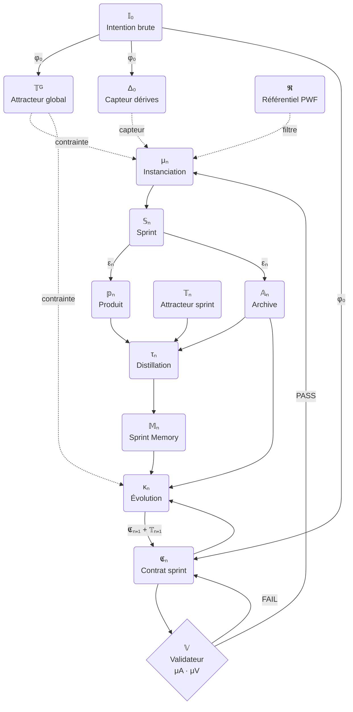

# Method — The CPE Pipeline

## What is CPE?

CPE (Canonical Pipeline Equation) is a formal method for executing projects as a chain of structured sprints. Each sprint starts where the previous one ended. The global vision never changes. The contracts evolve.

It is not a project management tool. It is a **formal grammar** for how work happens between a human and an AI.

---

## The Full Pipeline

### Single sprint (t=0 → t=1)

```
𝕀₀
 │
 ▼ φ₀ — clarification
(𝕮₀, 𝕋ᴳ, Δ₀)
 │
 ▼ 𝕍 — validation (scoring μA / μV)
PASS
 │
 ▼ μ₀ — instantiation (under filter 𝕽)
𝕊₀
 │
 ▼ ε₀ — production (under filter 𝕽)
(𝕡₀, 𝔸₀)
 │
 ▼ τ₀ — distillation
𝕄₀
 │
 ▼ κ₀ — evolution
(𝕮₁, 𝕋₁)
```

### The loop (sprint n → sprint n+1)



---

## The Three Invariants

### 1. 𝕋ᴳ never changes
The global attractor is produced once by φ₀ and constrains every subsequent μₙ and κₙ. It is the answer to: *"What does the finished project look like?"*

### 2. 𝕽 is always active
The Planning-With-Files reference (task_plan.md + findings.md + progress.md) filters every sprint execution. Nothing important exists only in memory.

### 3. κₙ closes the loop
Every sprint must end with κₙ. This operator takes `(𝕮ₙ, 𝔸ₙ, 𝕄ₙ, 𝕋ᴳ)` and produces `(𝕮ₙ₊₁, 𝕋ₙ₊₁)`. Without it, the chain breaks and context is lost.

---

## What Each Operator Does

| Operator | When | What it does |
|----------|------|--------------|
| φ₀ | Once, at project start | Clarifies intention into contract + global vision |
| 𝕍 | Before every sprint | Scores contract for ambiguity and validatability |
| μₙ | Sprint opening | Instantiates sprint under global constraints |
| εₙ | During sprint | Produces artifact + archives decisions |
| τₙ | Sprint closing | Distills archive into compact memory |
| κₙ | Sprint closing | Evolves contract into next sprint's contract |

---

## What Can Change (Axes of Variation)

- The definition of **𝕋ᴳ** (product vision, book plan, research goal...)
- The **granularity of 𝕄ₙ** (bullet list vs. full narrative)
- The **strictness of 𝕽** (light PWF vs. full audit)
- The **weight of Δ₀** (quick check vs. heavy drift detection)

---

## What Cannot Change

- The **order** of the operators: φ₀ → 𝕍 → μₙ → εₙ → τₙ → κₙ
- The **presence of 𝕍** before every sprint execution
- The **feeding of κₙ** with all four inputs
