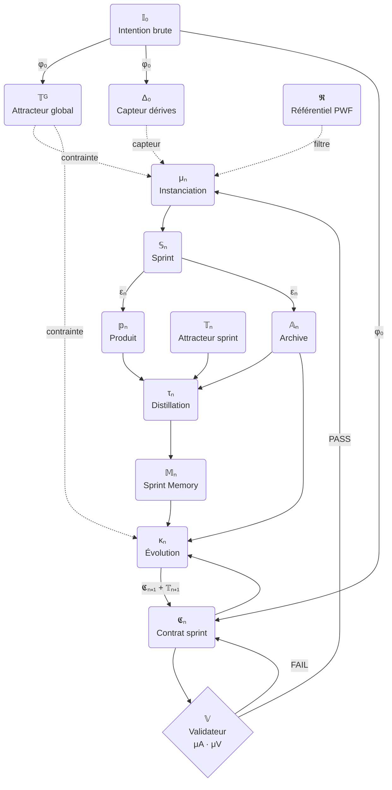

# Schéma CPE

```mermaid
flowchart TD
    I0("𝕀₀\nIntention brute")

    I0 -->|"φ₀"| TG("𝕋ᴳ\nAttracteur global")
    I0 -->|"φ₀"| D0("Δ₀\nCapteur dérives")
    I0 -->|"φ₀"| Cn("𝕮ₙ\nContrat sprint")

    R("𝕽\nRéférentiel PWF") -.->|filtre| mu

    Cn --> V{"𝕍\nValidateur\nμA · μV"}
    V -->|FAIL| Cn
    V -->|PASS| mu("μₙ\nInstanciation")

    TG -.->|contrainte| mu
    D0 -.->|capteur| mu

    mu --> Sn("𝕊ₙ\nSprint")

    Sn -->|"εₙ"| Pn("𝕡ₙ\nProduit")
    Sn -->|"εₙ"| An("𝔸ₙ\nArchive")

    Tn("𝕋ₙ\nAttracteur sprint") --> tau
    Pn --> tau("τₙ\nDistillation")
    An --> tau

    tau --> Mn("𝕄ₙ\nSprint Memory")

    Cn  --> kappa("κₙ\nÉvolution")
    An  --> kappa
    Mn  --> kappa
    TG  -.->|contrainte| kappa

    kappa -->|"𝕮ₙ₊₁ + 𝕋ₙ₊₁"| Cn
```
